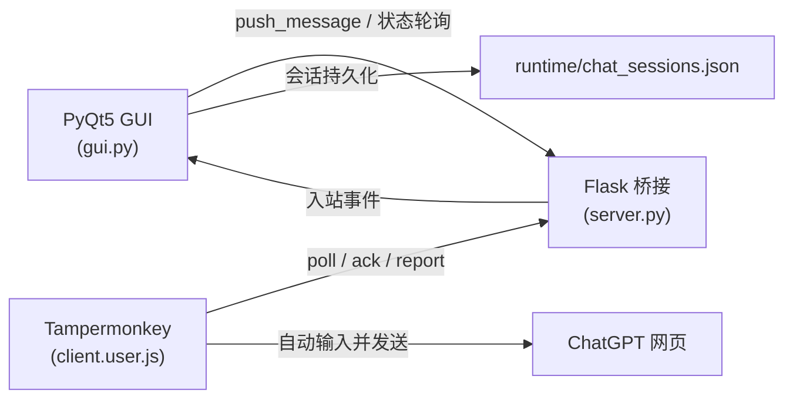

# 油猴脚本与 Python 联动

在本地用 **PyQt5 桌面 GUI** 管理多轮对话，通过 **Flask 桥接服务** 与 **Tampermonkey 油猴脚本** 联动，把消息发送到浏览器中的 ChatGPT 页面，并回传 assistant 回复。

适合需要在桌面侧统一收发、管理多个 ChatGPT 会话，又不想直接调用 OpenAI API 的场景。

## 架构



| 组件 | 文件 | 作用 |
|------|------|------|
| 桌面客户端 | `gui.py` / `app/ui/` | 对话列表、消息编辑、页面绑定、设置、日志 |
| 桥接服务 | `server.py` | 消息队列、油猴在线状态、页面匹配与下发 |
| 浏览器油猴脚本 | `client.user.js` | 浏览器端：轮询服务端、在 ChatGPT 页面发送并抓取回复 |
| 运行时数据 | `runtime/` | 本地会话 JSON、持久化配置 |

默认服务地址：`http://127.0.0.1:5000`  
油猴专用接口：`POST /api/bridge`（需请求头 `X-Request-Source: tampermonkey`）  
外部程序接口：`GET/POST /api/v1/*`（默认**不**注册；设 `CHATGPT_BRIDGE_ENABLE_EXTERNAL_API=1` 后启用，见「外部 API 客户端」）

## 环境要求

- Windows / macOS / Linux
- Python 3.10+（推荐 3.12）
- 浏览器已安装 [Tampermonkey](https://www.tampermonkey.net/)
- 可正常访问 ChatGPT 网页（`chatgpt.com` 或 `chat.openai.com`）

## 安装

```bash
cd 油猴脚本与Python联动
python -m venv .venv

# Windows
.venv\Scripts\activate

# macOS / Linux
# source .venv/bin/activate

pip install -r requirements.txt
```

依赖见 `requirements.txt`：

- `flask` / `flask-cors` — 本地 HTTP 桥接
- `PyQt5` — 桌面 GUI

## 快速开始

1. **启动 GUI**

   ```bash
   python gui.py
   ```

2. **启动 GUI**  
   程序会自动在 `127.0.0.1:5000` 启动桥接服务；确认顶部状态栏显示油猴可连接。

3. **安装油猴脚本**  
   - 将 `client.user.js` 粘贴到 Tampermonkey 并保存（仓库内仅此一份维护脚本）  
   - 桥接服务固定监听 `127.0.0.1:5000`；若曾改过端口，在油猴菜单 **「浏览器桥接 · 设置」** 中填写地址（无需改脚本源码）

4. **打开 ChatGPT**  
   在浏览器中打开 [ChatGPT 首页](https://chatgpt.com/) 或任意对话页，刷新页面，确认脚本已运行（浏览器控制台可见 `[联动]` 日志）。

5. **在 GUI 中新建对话并发送**  
   - 点击「新建对话」  
   - 输入内容并发送  
   - 首条消息会通过**空白首页**创建新的 ChatGPT 对话，完成后自动绑定

界面示意可参考项目中的 `效果图.png`。

## 外部 API 客户端

其他 Python 程序可通过 `bridge_client.py` 调用本地桥接服务（需 **GUI 已启动且服务已开启**）。

### 库用法

```python
from bridge_client import BridgeClient, BridgeApiError

client = BridgeClient(base_url="http://127.0.0.1:5000")
# 若设置了环境变量 CHATGPT_PAGE_BRIDGE_TOKEN，会自动带鉴权头

reply = client.ask("你好，请介绍一下你自己")
print(reply)
```

常用方法：

| 方法 | 说明 |
|------|------|
| `client.ask(text)` | 同步发送并等待回复 |
| `client.send(text)` | 异步发送，返回 `request_id` |
| `client.wait_result(request_id)` | 轮询异步结果 |
| `client.status()` | 服务与油猴状态 |
| `client.list_sessions()` | 列出 GUI 会话 |
| `client.create_session(title)` | 新建会话 |

### 命令行

可直接运行 `bridge_client.py`（Windows 下双击会进入交互模式，退出前会等待按键，避免窗口闪退）：

```bash
# 交互对话（双击 bridge_client.py 等同此模式）
python bridge_client.py

# 单次提问
python bridge_client.py "你好"

# 查看服务状态
python bridge_client.py --status
```

环境变量（可选）：

- `CHATGPT_PAGE_BRIDGE_URL` — 服务地址，默认 `http://127.0.0.1:5000`
- `CHATGPT_PAGE_BRIDGE_TOKEN` — 与 GUI 服务端一致的 API token

库调用示例见 `bridge_client.py` 模块文档字符串。

## 页面绑定规则（重要）

启用「每个对话绑定独立页面」后：

| 场景 | 行为 |
|------|------|
| **新建 GUI 对话** | 只能绑定空白 ChatGPT **首页**（`home`），不能绑定已有历史的 **conversation** 页 |
| **首条消息** | 优先使用空闲首页；若无则自动打开带绑定令牌的新首页 |
| **创建成功** | 首页发送首条消息后跳转到 `/c/xxx`，GUI 再正式绑定该 `conversation_id` |
| **已有对话继续聊** | 仅允许绑定到**同一** `conversation_id` 的页面 |

左侧会话列表会用颜色区分状态：未绑定、预绑定首页、已绑定在线、绑定离线、绑定异常等。

手动「绑定所选页面」**不会**把新建空白对话绑到旧网页对话；若需接管已有网页上下文，需后续单独实现「接管已有对话」功能。

## 项目结构

```
油猴脚本与Python联动/
├── gui.py                 # 主 GUI 入口（含桥接服务）
├── bridge_client.py       # 外部 API Python 客户端库（含 CLI）
├── server.py              # Flask 桥接服务（也可单独 python server.py 调试）
├── client.user.js         # Tampermonkey 用户脚本（唯一维护版本）
├── log_utils.py           # 统一日志
├── requirements.txt
├── runtime/               # 运行时数据（会话、可 gitignore）
│   └── chat_sessions.json
├── app/
│   ├── models.py          # 会话 / 绑定状态模型
│   ├── constants.py       # 常量与默认设置
│   ├── utils/page_status.py  # 页面在线/同步/发送统一判定
│   └── ui/                # PyQt 界面与 mixin
│       ├── main_window.py
│       └── mixins/        # 桥接、绑定、会话、设置等
├── export_for_chatgpt.py  # 导出代码供 ChatGPT 阅读（开发辅助）
└── tools/                 # 重构脚本等开发工具
```

## 配置说明

- **服务地址 / 端口**：固定 `127.0.0.1:5000`（本机）
- **会话保存路径**：默认 `runtime/chat_sessions.json`
- **油猴连接地址**：油猴菜单「浏览器桥接 · 设置」，需与 GUI 端口一致（默认 `http://127.0.0.1:5000/api/bridge`）
- **API Token**：环境变量 `CHATGPT_PAGE_BRIDGE_TOKEN`；启用后油猴设置中需填写相同 Token
- **调试日志**：项目根目录 `log.txt`，GUI 内也可查看

桥接行为（页面绑定、同步策略等）已内置为固定默认值，见 `app/constants.py` 中的 `DEFAULT_APP_SETTINGS` 与 `FIXED_BRIDGE_BEHAVIOR_SETTINGS`。

## 油猴 ↔ 服务端协议（简述）

油猴周期性 `poll`，服务端返回待发送消息或控制命令；执行后通过 `ack` 确认，通过 `report` 上报 `assistant_reply`、`send_failed`、`conversation_created` 等事件。

- **bootstrap 消息**：仅能被 `page_type=home` 且无 `conversation_id` 的页面领取  
- **普通聊天消息**：仅能被匹配的 `conversation` 页面领取  

详细逻辑见 `server.py` 的 `_message_matches_page()` 与 `client.user.js` 中的发送前校验。

## Bridge 页面字段规范（统一命名）

油猴 `client.user.js`、Flask `server.py`、GUI `app/utils/page_status.py` 共用一套能力判定，避免「在线但不能同步/发送」类误判。

| 字段 | 含义 | 判定要点 |
|------|------|----------|
| `client_id` | 油猴客户端 ID | `sessionStorage` 持久化，勿与消息 `id` 混淆 |
| `page_instance_id` | 页面实例 ID | 与 `getToolboxPageInstanceId()` 一致，每标签页稳定 |
| `page_key` | `client_id::page_instance_id` | 后端注册与绑定匹配 |
| `conversation_id` | ChatGPT 对话 ID | 从 `/c/xxx` URL 解析 |
| `url` | 当前完整页面地址 | **唯一字段**；入站若带 `page_url` / `target_url` 等旧名会被拒绝 |
| `message_id` | Bridge 消息 ID | **唯一字段**；入站 `id` 等旧名会被拒绝 |
| `content` | 待发送文本 | **唯一字段**；入站 `text` / `message` / `prompt` 等旧名会被拒绝 |
| `assistant_text` | 助手回复 | 不再与 `content` 混写 |
| `online` | 页面在线 | **仅**看最近心跳 `last_seen` |
| `syncable` | URL 级可同步 | `online` + `url` 非空 |
| `conversation_syncable` | 对话可同步 | `online` + `conversation_id` + `/c/` 对话页 |
| `sendable` | 可发送 | `online` + 输入框可用 + 发送按钮可用（生成中会排队） |
| `can_accept_input` / `can_send_now` | 油猴上报的输入/发送能力 | 供 GUI 展示，**不**作为同步硬条件 |
| `visibility_state` / `has_focus` | 可见性/焦点 | 仅日志与展示，不拦截同步 |
| `active_tab` | 工具箱当前 tab | 页面级 `pageState`，新页默认 `upload` |
| `upload_active_group_id` | 上传分组 | 页面级持久化 |
| `quick_prompt_category` | 快捷 Prompt 分类 | 页面级，勿与全局设置混读 |

发送统一入口：油猴 `sendContentViaComposer()`。路由变化统一走 `runToolboxRouteChangePipeline()`（先恢复 pageState，再 `identity_change`）。

油猴 Bridge 状态栏不再仅用「在线」，而区分 **已连接 / 可发送 / 生成中 / 不可发送**（`getBridgePollStatusPresentation()`）。Bridge 设置页展示当前页 **能力明细**（`#cgpt-bridge-capability-text`）。工具箱隐藏状态保存为 `panel_hidden`、`edge_docked`、`edge_revealed`、`floating_hidden`（DOM 类 `cgpt-toolbox-floating-hidden` 与旧 `cgpt-edge-hidden` 双写兼容）。

## 常见问题

**GUI 显示油猴离线**  
确认已启动服务、浏览器已打开 ChatGPT 页面、脚本已启用，油猴设置中的 Bridge 地址正确，且 Tampermonkey 已允许 `@connect` 目标主机。

**发送后一直「等待回复」**  
检查 ChatGPT 页面是否登录、输入框与发送按钮是否被页面改版影响；查看 `log.txt` 与浏览器控制台 `[联动]` 输出。

**新建对话却串到旧网页对话**  
更新到当前版本后，新建对话不应再自动绑旧 conversation；若列表显示「绑定异常」，可点击「解除绑定」后重新发送首条消息。

**端口被占用**  
在 GUI 设置中更换端口，并在油猴菜单「ChatGPT Bridge 设置」中同步修改地址后刷新 ChatGPT 页面。

## 开发说明

单独启动桥接服务（无 GUI）：

```bash
python server.py
```

导出项目源码合并包（便于发给 ChatGPT 分析）：

```bash
python export_for_chatgpt.py
```

### 生产发布包

主 GUI 运行链路只依赖 `gui.py` / `app/`、`server.py`、`bridge_client.py`、`client.user.js` 和运行时配置。制作精简发布包时可排除 `tests/`、`tools/`、`export_for_chatgpt.py` 等开发辅助内容。

## 免责声明

本项目通过浏览器自动化与 ChatGPT 网页交互，请遵守 OpenAI 服务条款与当地法律法规。仅供个人学习与研究使用；使用本工具产生的账号风险与数据安全由使用者自行承担。
